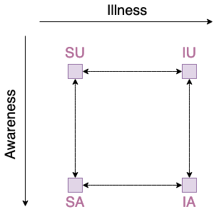

======================================
Class ``nd.models.CompartmentalGraph``
======================================

What is a compartmental graph?
==============================
If the experiment includes more than two phenomena interacting with one another,
a description of the propagation model becomes more complex. For example, a
model with two phenomena, each with two local steps:

* Suspected-Infected (phenomenon Illness),
* Aware-Unaware (phenomenon "Awareness"),

has four possible global states (i.e., each agent has to be in one of those
states):

* Suspected~Aware
* Suspected~Unaware,
* Infected~Aware,
* Infected~Unaware

and eight possible transitions (i.e., possible ways for agents to change their
states):

* Suspected~Aware -> Suspected~Unaware,
* Suspected~Aware <- Suspected~Unaware,
* Infected~Aware -> Infected~Unaware,
* Infected~Aware <- Infected~Unaware,
* Suspected~Aware -> Infected~Aware,
* Suspected~Aware <- Infected~Aware,
* Suspected~Unaware -> Infected~Unaware,
* Suspected~Unaware <- Infected~Unaware.

This can be easily visualised by the following graph:

Note that with three interacting phenomena of respectively two, two, and three
local states, we have twelve global states with (sic!) 48 possible transitions.
Thus, the library includes the class ``CompartmentalGraph`` to define a model
semi-automatically with no limit on the number of phenomena or states. The user
must determine the names of phenomena, local states, and only the transitions
relevant to the simulation.

Example of usage
================
Define a ``CompartmentalGraph`` with three phenomena, where two of them
(``phenomena_1``, ``phenomena_2``) have two local states, and one
(``phenomena_3``) has three local states. Then assign probabilities of
transitions between the states.

Define the object to store states and transitions:

.. code-block:: python

    import network_diffusion as nd
    compartments = nd.models.CompartmentalGraph()

Assign phenomena and local states; then compile it and review the results:

.. code-block:: python

    compartments.add("phenomenon_1", ("A", "B"))
    compartments.add("phenomenon_2", ("A", "B"))
    compartments.add("phenomenon_3", ("A", "B", "C"))
    compartments.compile(background_weight=.0)

    print(compartments)

.. code-block:: console

    ============================================
    compartmental model
    --------------------------------------------
    processes, their states and initial sizes:
    --------------------------------------------
    process 'phenomenon_1' transitions with nonzero weight:
    --------------------------------------------
    process 'phenomenon_2' transitions with nonzero weight:
    --------------------------------------------
    process 'phenomenon_3' transitions with nonzero weight:
    ============================================

Since the ``background_weight`` is set to 0.0, no transitions are made during
the compilation process. However, if provided, the resulting compartmental graph
contains all possible transitions with the same probability of occurrence (that
is, the value of the parameter ``background_weight``). In this example, set up
the transition weights manually:

.. code-block:: python

    compartments.set_transition_canonical(
        "phenomenon_1",
        (
            ("phenomenon_1.A", "phenomenon_2.A", "phenomenon_3.A"),
            ("phenomenon_1.B", "phenomenon_2.A", "phenomenon_3.A")
        ),
        0.5,
    )
    print(compartments)

.. code-block:: console

    ============================================
    compartmental model
    --------------------------------------------
    processes, their states and initial sizes:
    --------------------------------------------
    process 'phenomenon_1' transitions with nonzero weight:
        from A to B with probability 0.5 and constrains ['phenomenon_2.A' 'phenomenon_3.A']
    --------------------------------------------
    process 'phenomenon_2' transitions with nonzero weight:
    --------------------------------------------
    process 'phenomenon_3' transitions with nonzero weight:
    ============================================

We can also do it in a faster way:

.. code-block:: python

    compartments.set_transition_fast(
        "phenomenon_3.A",
        "phenomenon_3.B",
        ("phenomenon_1.B", "phenomenon_2.B"),
        0.6,
    )
    print(compartments)

.. code-block:: console

    ============================================
    compartmental model
    --------------------------------------------
    processes, their states and initial sizes:
    --------------------------------------------
    process 'phenomenon_1' transitions with nonzero weight:
        from A to B with probability 0.5 and constrains ['phenomenon_2.A' 'phenomenon_3.A']
    --------------------------------------------
    process 'phenomenon_2' transitions with nonzero weight:
    --------------------------------------------
    process 'phenomenon_3' transitions with nonzero weight:
        from A to B with probability 0.6 and constrains ['phenomenon_1.B' 'phenomenon_2.B']
    ============================================

There is also functionality for assigning transition weights at random:

.. code-block:: python

    compartments.set_transitions_in_random_edges([[0.2, 0.3, 0.4], [0.2], [0.3]])
    print(compartments)

.. code-block:: console

    ============================================
    compartmental model
    --------------------------------------------
    processes, their states and initial sizes:
    --------------------------------------------
    process 'phenomenon_1' transitions with nonzero weight:
        from A to B with probability 0.5 and constrains ['phenomenon_2.A' 'phenomenon_3.A']
        from B to A with probability 0.3 and constrains ['phenomenon_2.A' 'phenomenon_3.A']
        from A to B with probability 0.2 and constrains ['phenomenon_2.A' 'phenomenon_3.C']
        from A to B with probability 0.4 and constrains ['phenomenon_2.B' 'phenomenon_3.B']
    --------------------------------------------
    process 'phenomenon_2' transitions with nonzero weight:
        from B to A with probability 0.2 and constrains ['phenomenon_1.A' 'phenomenon_3.C']
    --------------------------------------------
    process 'phenomenon_3' transitions with nonzero weight:
        from C to A with probability 0.3 and constrains ['phenomenon_1.A' 'phenomenon_2.A']
        from A to B with probability 0.6 and constrains ['phenomenon_1.B' 'phenomenon_2.B']
    ============================================

The propagation model is stored as a dictionary of ``networkx`` graphs. Hence,
we can draw it, but as the model grows larger, the readability of the visualisation
decreases:

.. code-block:: python

    import matplotlib.pyplot as plt

    for n, l in compartments.graph.items():
        plt.title(n)
        nx.draw_networkx_nodes(l, pos=nx.circular_layout(l))
        nx.draw_networkx_edges(l, pos=nx.circular_layout(l))
        nx.draw_networkx_edge_labels(l, pos=nx.circular_layout(l), font_size=5)
        nx.draw_networkx_labels(l, pos=nx.circular_layout(l), font_size=5)
        plt.show()
