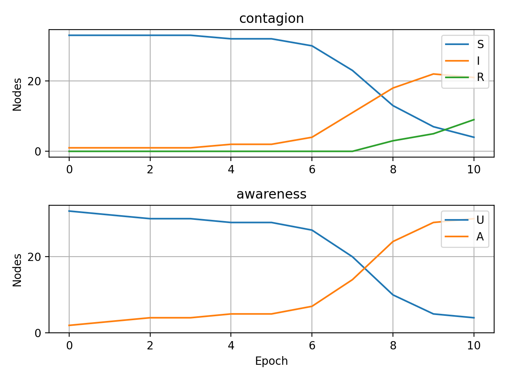

======================
Performing simulations
======================

How the simulator works?
______________________________
Simulator is a class that allows to perform previously designed experiment. To
run it we need a network (multilayer or temporal, note that it can as well have
one layer) and a corresponding model. After the experiment is completed, user is
able to see results in form of report and visualisation of global states of the
nodes.

In a following example we will consider a custom SIR~UA model, i.e. spreading of
two processes in separate layers but dependent on each other:
* "contagion" process with states S (suspected), I (infecetd), R (removed),
* "awareness" process with states U (unaware), A (aware).
The possible transitions can be desctibed on a following graph:

.. code-block:: text

                        S·U---->I·U---->R·U
                         |       |       |
                         |       |       |
                         v       v       v
                        S·A---->I·A---->R·A

All transitions except I->R are determined by interactions between  neighbouring
nodes. Nodes can transit from I to R without any external  impulses. Parameters
of the constructor are paobabilities of transitions and initial %s of infected
and aware nodes.

Example of usage
________________
1. Import necessary libraries

.. literalinclude:: simulator_example.py
   :language: python
   :lines: 7-15

2. Create the propagation model

.. literalinclude:: simulator_example.py
   :language: python
   :linenos:
   :lines: 20-219

3. Load the network

.. literalinclude:: simulator_example.py
   :language: python
   :lines: 224-227

.. code-block:: console

    ============================================
    network parameters
    --------------------------------------------
    general parameters:
            number of layers: 2
            number of actors: 34
            number of nodes: 68
            number of edges: 156

    layer 'contagion' parameters:
            graph type - <class 'networkx.classes.graph.Graph'>
            number of nodes - 34
            number of edges - 78
            average degree - 4.5882
            clustering coefficient - 0.5706

    layer 'awareness' parameters:
            graph type - <class 'networkx.classes.graph.Graph'>
            number of nodes - 34
            number of edges - 78
            average degree - 4.5882
            clustering coefficient - 0.5706
    ============================================

4. Initialise an instance of the propagation model

.. literalinclude:: simulator_example.py
   :language: python
   :lines: 231-240

.. code-block:: console

    ============================================
    SIR-UA Model
    ============================================
    compartmental model
    --------------------------------------------
    processes, their states and initial sizes:
            'contagion': [S:95%, I:5%, R:0%]
            'awareness': [U:95%, A:5%]
    --------------------------------------------
    process 'contagion' transitions with nonzero weight:
            from S to I with probability 0.19 and constrains ['awareness.U']
            from I to R with probability 0.1 and constrains ['awareness.U']
            from S to I with probability 0.0665 and constrains ['awareness.A']
            from I to R with probability 0.1 and constrains ['awareness.A']
    --------------------------------------------
    process 'awareness' transitions with nonzero weight:
            from U to A with probability 0.01 and constrains ['contagion.S']
            from U to A with probability 0.71 and constrains ['contagion.I']
            from U to A with probability 0.01 and constrains ['contagion.R']
    ============================================
    ============================================
    seed selection method
    --------------------------------------------
            nodewise random choice
    ============================================

5. Perform the simulation

.. literalinclude:: simulator_example.py
   :language: python
   :lines: 244-245

6. Save experiment results. User is able to save them to the file or print them out

.. literalinclude:: simulator_example.py
   :language: python
   :lines: 249

The logs contain:
* a description of the network (txt file),
* a description of the propagation model (txt file),
* a report of the spreading for all simulated phenomena (separate csv files),
* a capture of states of every single node at the end of each simulation step (JSON file),
* a brief visualisation of propagation.

In case of need to process the results directly in the Python, one can extract them with two
functions. For aggregated results for each process

.. literalinclude:: simulator_example.py
   :language: python
   :lines: 253

or for the detailed logs concerning all nodes

.. literalinclude:: simulator_example.py
   :language: python
   :lines: 257
