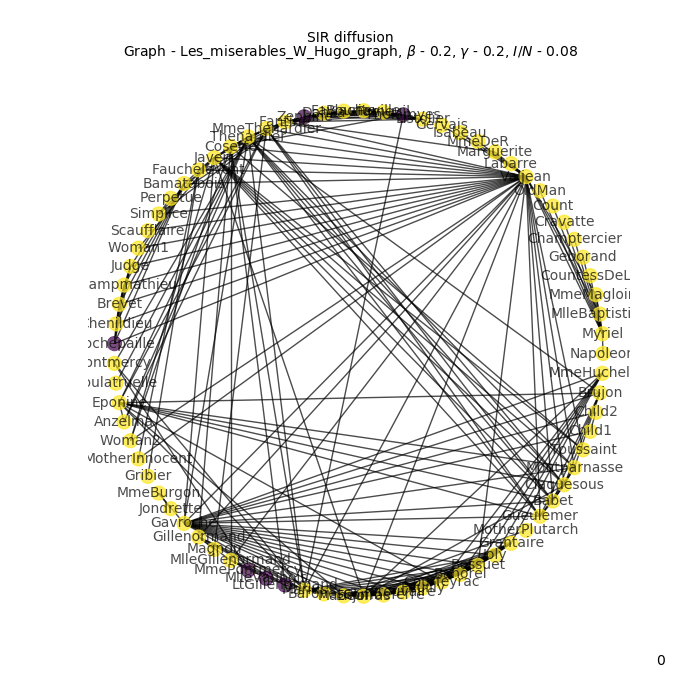
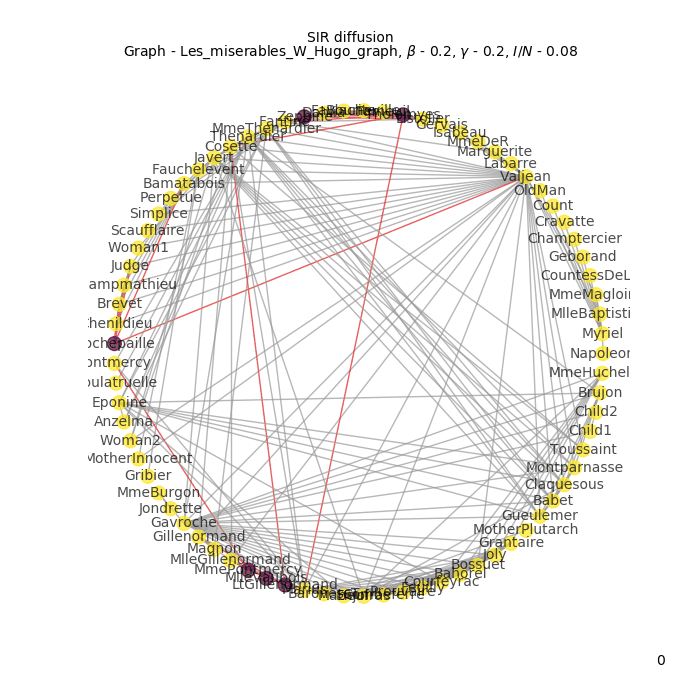

Module  ``flat_spreading``
==========================

SI diffusion - experiment and visualisation
________________________________________________

**Experiment**

To perform an experiment, user has to upload graph **G** using ``networkx`` library. After that there is need to define
parameters of experiment - beta coefficient and fraction of infected nodes. Here is an example code::

    import networkx as nx
    import matplotlib.pyplot as plt
    import flat_spreading as fs

    M = nx.les_miserables_graph()

    out_dir = '/foo/bar/bla/'

    list_S, list_I, list_iter, nodes_infected, par =
        fs.si_diffusion(M, fract_I=0.05, beta_coeff=0.2,
        name='Les_miserables_V_Hugo_graph')

By saving results of ``si_diffusion`` to variables above there is a possibility to visualise experiment.

**Visualisation**

User is able to visualise SI diffusion in two ways:
    * by cumulative figure of state of all nodes
    * by animated figure showing state in each eopch of:
        * nodes
        * nodes and edges

Here are some examples::

    fig, ax = plt.subplots(1)
    plt.plot(list_iter, list_S, label='suspected')
    plt.plot(list_iter, list_I, label='infected')
    plt.title('SI diffusion')
    plt.legend()
    plt.grid()
    plt.savefig("{}.png".format(par[0]), dpi=150)
    plt.show()

.. figure::  images/Les_miserables_V_Hugo_graph.png
    :align:   center
    :width: 400

    Figure which shows state of all nodes in graph during SI experiment.

::

    fs.visualise_si_nodes(M, nodes_infected, par, out_dir)

.. figure::  images/Les_miserables_V_Hugo_graph_si_n.gif
    :align:   center
    :width: 400

::

    fs.visualise_si_nodes_edges(M, nodes_infected, par, out_dir)

.. figure::  images/Les_miserables_V_Hugo_graph_si_ne.gif
    :align:   center
    :width: 400

SIR diffusion - experiment and visualisation
________________________________________________

**Experiment**

To perform an experiment, user has to upload graph **G** using ``networkx`` library. After that there is need to define
parameters of experiment - beta coefficient and fraction of infected nodes. Here is an example code::

    import networkx as nx
    import matplotlib.pyplot as plt
    import flat_spreading as fs

    M = nx.les_miserables_graph()

    out_dir = '/foo/bar/bla/'

    list_S, list_I, list_R, list_iter, nodes_infected, nodes_recovered,
        par = fs.sir_diffusion(M, fract_I=0.08, beta_coeff=0.2,
        gamma_coeff=0.2, name='Les_miserables_W_Hugo_graph')

By saving results of ``sir_diffusion`` to variables above there is a possibility to visualise experiment.

**Visualisation**

User is able to visualise SIR diffusion in two ways:
    * by cumulative figure of state of all nodes
    * by animated figure showing state in each eopch of:
        * nodes
        * nodes and edges

Here are some examples::

    fig, ax = plt.subplots(1)
    plt.plot(list_iter, list_S, label='suspected')
    plt.plot(list_iter, list_I, label='infected')
    plt.plot(list_iter, list_R, label='recovered')
    plt.title('SIR diffusion')
    plt.legend()
    plt.grid()
    plt.savefig("{}.png".format(par[0]), dpi=150)
    plt.show()

.. figure::  images/Les_miserables_W_Hugo_graph.png
    :align:   center
    :width: 400

    Figure which shows state of all nodes in graph during SIR experiment.

::

    fs.visualise_sir_nodes(M, nodes_infected, nodes_recovered, par, out_dir)

::

    fs.visualise_sir_nodes_edges(M, nodes_infected,
        nodes_recovered, par, out_dir)

