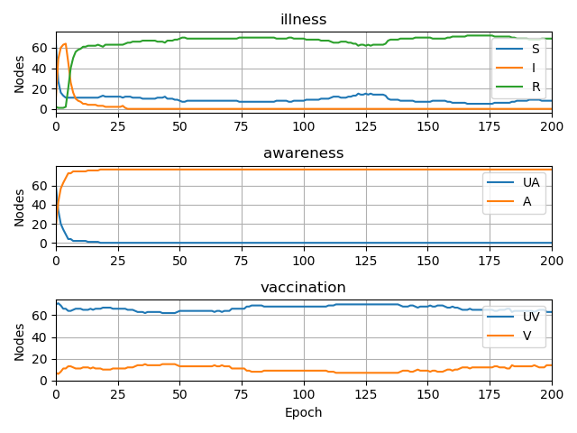

Module  ``multi_spreading``
==============================

What is multilayer spreading?
______________________________
Multilayer spreading is a module which enables to perform previously designed
experiment. To run it we need a network of Multilayer class (note that it
can as well have one layer) and corresponding model. After the experiment
is completed user is able to see results in form of report and visualisation
of global states of the nodes.

Example of usage
________________
1. Initialise multilayer network from nx predefined network::

    import networkx as nx
    from network_diffusion.mln.mlnetwork import MultilayerNetwork

    network = MultilayerNetwork()
    names = ['illness', 'awareness', 'vaccination']
    network.from_nx_layer(nx.les_miserables_graph(), names)

2. Initialise propagation model and set possible transitions with probabilities::

    model = PropagationModel()
    phenomenas = [('S', 'I', 'R'), ('UA', 'A'), ('UV', 'V')]
    for l, p in zip(names, phenomenas):
        model.add(l, p)
    model.compile(background_weight=0.005)

    model.set_transition('illness.S', 'illness.I', ['vaccination.UV', 'awareness.UA'], 0.9)
    model.set_transition('illness.S', 'illness.I', ['vaccination.V', 'awareness.A'], 0.05)
    model.set_transition('illness.S', 'illness.I', ['vaccination.UV', 'awareness.A'], 0.2)
    model.set_transition('illness.I', 'illness.R', ['vaccination.UV', 'awareness.UA'], 0.1)
    model.set_transition('illness.I', 'illness.R', ['vaccination.V', 'awareness.A'], 0.7)
    model.set_transition('illness.I', 'illness.R', ['vaccination.UV', 'awareness.A'], 0.3)

    model.set_transition('vaccination.UV', 'vaccination.V', ['awareness.A', 'illness.S'], 0.03)
    model.set_transition('vaccination.UV', 'vaccination.V', ['awareness.A', 'illness.I'], 0.01)

    model.set_transition('awareness.UA', 'awareness.A', ['vaccination.UV', 'illness.S'], 0.05)
    model.set_transition('awareness.UA', 'awareness.A', ['vaccination.V', 'illness.S'], 1)
    model.set_transition('awareness.UA', 'awareness.A', ['vaccination.UV', 'illness.I'], 0.2)

    model.set_transition('illness', (('awareness.UA', 'illness.R', 'vaccination.UV'),
        ('awareness.UA', 'illness.I', 'vaccination.UV')), 0.7)

3. Initialise starting parameters of propagation in network. Parameters' names
must correspond with names in model and network. Numbers in tuples describe
how many nodes has which local state (in alphabetic order)::

    phenomenas = {'illness': (70, 6, 1), 'awareness': (60, 17), 'vaccination': (70, 7)}

4. Perform propagation experiment. Propagation lasts as many epochs as
defined (here 200). After the experiment, Logger object is returned where logs
are being stored::

    experiment = MultiSpreading(model, network)
    experiment.set_initial_states(phenomenas)
    logs = experiment.perform_propagation(200)

5. Save experiment results. User is able to save them to file or print out to
the console::

        logs.report(to_file=True, path=getcwd()+'/results', visualisation=True)

    Logs contain:
        - description of the network (txt file)
        - description of the propagation model (txt file)
        - propagation report in all phenomena (separate csv file for each)
        - visualisation of propagation

