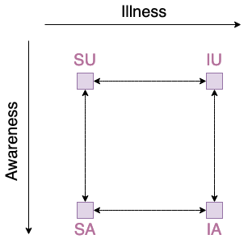

Module  ``propagation_model``
=============================

What is propagation model?
__________________________
In this library propagation model is considered as one or a plenty of
phenomenas acting in one network, e.g. Suspected-Infected model with it's
parameters like beta coefficient.

Purpose of PropagationModel module
___________________________________
If experiment includes more than two phenomenas interacting with themselves,
description of the propagation model becoming very complicated. E.g. model
with 2 phenomenas with 2 local steps each:

* Suspected-Infected (phenomena Illness),
* Aware-Unaware (phenomena "Awareness"),

has 4 possible global states (i.e. for multiplex network each node has to be
in one of those states):

* Suspected~Aware
* Suspected~Unaware,
* Infected~Aware,
* Infected~Unaware

and 8 possible transitions (i.e. possible ways for nodes in Multiplex network
to change states):

* Suspected~Aware -> Suspected~Unaware,
* Suspected~Aware <- Suspected~Unaware,
* Infected~Aware -> Infected~Unaware,
* Infected~Aware <- Infected~Unaware,
* Suspected~Aware -> Infected~Aware,
* Suspected~Aware <- Infected~Aware,
* Suspected~Unaware -> Infected~Unaware,
* Suspected~Unaware <- Infected~Unaware.

This can be easily visualized by graph:

::

Note that with 3 phenomenas of respectively 2, 2, 3 local states we have 12
global states with (sic!) 48 possible transitions. This is so big value, that
without computer assistance it is difficult to handle cases like this. Thus
library contains module named ``propagation_model`` to define model in semi
automatic way with no constrains coming from number od phenomenas and number
of states. User defines names of phenomenas, local states and only these
transitions which are relevant to the simulation.

Example of usage
________________
Let's define model with 3 phenomenas, 2 (``layer_1``, ``layer_2``) with 2 local states
each (``A``, ``B``) and 1 (``layer_3``) with 3 local states (``A``, ``B``, ``C``). Then assign
probabilities of transitions between certain states.

Define object of model propagation::

    from network_diffusion import PropagationModel
    model = PropagationModel()

Assign phenomenas and local states. Then compile it ad see results::

    model.add('layer_1', ('A', 'B'))
    model.add('layer_2', ('A', 'B'))
    model.add('layer_3', ('A', 'B', 'C'))
    model.compile()
    model.describe()

.. code-block:: console

    ============================================
    model of propagation
    --------------------------------------------
    phenomenas and their states:
    layer_1: ('A', 'B')
    layer_2: ('A', 'B')
    layer_3: ('A', 'B', 'C')
    background_weight: 0.0
    layer 'layer_1' transitions with nonzero probability:
    layer 'layer_2' transitions with nonzero probability:
    layer 'layer_3' transitions with nonzero probability:
    ============================================

Assign nonzero probabilities to the propagation model code::

    model.set_transition('layer_1', (('layer_1.A', 'layer_2.A', 'layer_3.A'),
        ('layer_1.B', 'layer_2.A', 'layer_3.A')), 0.5)
    model.describe()

.. code-block:: console

    ============================================
    model of propagation
    --------------------------------------------
    phenomenas and their states:
        layer_1: ('A', 'B')
        layer_2: ('A', 'B')
        layer_3: ('A', 'B', 'C')
        background_weight: 0.0
    layer 'layer_1' transitions with nonzero probability:
        from A to B with probability 0.5 and constrains ['layer_2.A' 'layer_3.A']
    layer 'layer_2' transitions with nonzero probability:
    layer 'layer_3' transitions with nonzero probability:
    ============================================

Set random transitions and see all model::

    model.set_transitions_in_random_edges([[0.2, 0.3, 0.4], [0.2], [0.3]])
    model.describe()

.. code-block:: console

    ============================================
    model of propagation
    --------------------------------------------
    phenomenas and their states:
        layer_1: ('A', 'B')
        layer_2: ('A', 'B')
        layer_3: ('A', 'B', 'C')
        background_weight: 0.0
    layer 'layer_1' transitions with nonzero probability:
        from A to B with probability 0.2 and constrains ['layer_2.A' 'layer_3.A']
        from B to A with probability 0.3 and constrains ['layer_2.B' 'layer_3.A']
        from A to B with probability 0.4 and constrains ['layer_2.B' 'layer_3.C']
    layer 'layer_2' transitions with nonzero probability:
        from A to B with probability 0.2 and constrains ['layer_1.B' 'layer_3.B']
    layer 'layer_3' transitions with nonzero probability:
        from C to B with probability 0.3 and constrains ['layer_1.B' 'layer_2.B']
    ============================================

Because of the propagation model is stored as a dictionary of ``networkx``
graphs, user is able to draw it, but as the model is bigger as the readability
of visualisation is less::

    import matplotlib.pyplot as plt
    for n, l in model.graph.items():
        plt.title(n)
        nx.draw_networkx_nodes(l, pos=nx.circular_layout(l))
        nx.draw_networkx_edges(l, pos=nx.circular_layout(l))
        nx.draw_networkx_edge_labels(l, pos=nx.circular_layout(l))
        nx.draw_networkx_labels(l, pos=nx.circular_layout(l))
        plt.show()
