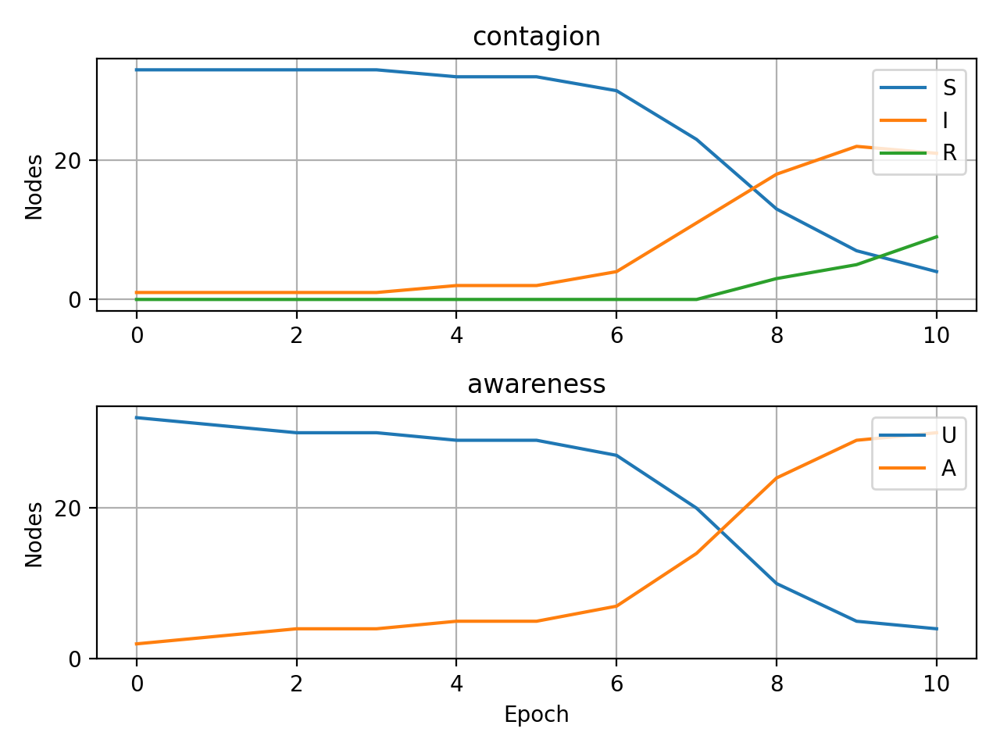

======================
Performing simulations
======================

How the simulator works?
______________________________
Simulator is a class that allows to perform previously designed experiment. To
run it we need a network (multilayer or temporal, note that it can as well have
one layer) and a corresponding model. After the experiment is completed, user is
able to see results in form of report and visualisation of global states of the
nodes.

In a following example we will consider a custom SIR~UA model, i.e. spreading of
two processes in separate layers but dependent on each other:
* "contagion" process with states S (suspected), I (infecetd), R (removed),
* "awareness" process with states U (unaware), A (aware).
The possible transitions can be desctibed on a following graph:
                        S·U---->I·U---->R·U
                         |       |       |
                         |       |       |
                         v       v       v
                        S·A---->I·A---->R·A
All transitions except I->R are determined by interactions between  neighbouring
nodes. Nodes can transit from I to R without any external  impulses. Parameters
of the constructor are paobabilities of transitions and initial %s of infected
and aware nodes.

Example of usage
________________
1. Import necessary libraries:

.. code-block:: python

    import networkx as nx
    import network_diffusion as nd
    import numpy as np

2. Create the propagation model:

.. code-block:: python

    class SIR_UAModel(nd.models.BaseModel):

        def __init__(
            self,
            alpha: int,
            alpha_prime: int,
            beta: int,
            gamma: int,
            delta: int,
            ill_seeds: int,
            aware_seeds: int,
        ) -> None:
            """
            A model SIR~UA.

            :param alpha: weight prob. of S->I for unaware nodes
            :param alpha_prime: prob. of S->I for aware nodes
            :param beta: prob. of I->R for both unaware and aware nodes
            :param gamma: prob. of U->A for both suspected and removed nodes
            :param delta: prob. of U->A for ill nodes
            :param ill_seeds: % of initially I nodes
            :param aware_seeds: % of initially A nodes
            """
            compartments = self._create_compartments(
                alpha=alpha,
                alpha_prime=alpha_prime,
                beta=beta,
                gamma=gamma,
                delta=delta,
                ill_seeds=ill_seeds,
                aware_seeds=aware_seeds,
            )
            self.__comp_graph = compartments
            self.__seed_selector = nd.seeding.RandomSeedSelector()

        @staticmethod
        def _create_compartments(
            alpha: int,
            alpha_prime: int,
            beta: int,
            gamma: int,
            delta: int,
            ill_seeds: int,
            aware_seeds: int,
        ) -> nd.models.CompartmentalGraph:
            # define processes, allowed states and initial % of actors in that states
            phenomena = {
                "contagion": [["S", "I", "R"], [100 - ill_seeds, ill_seeds, 0]],
                "awareness": [["U", "A"], [100 - aware_seeds, aware_seeds]]
            }

            # wrap them into a compartments
            cg = nd.models.CompartmentalGraph()
            for phenomenon, [states, budget] in phenomena.items():
                cg.add(process_name=phenomenon, states=states)  # name of process
                cg.seeding_budget.update({phenomenon: budget})  # initial %s
            cg.compile(background_weight=0)

            # set up weights of transitions for SIR and unaware
            cg.set_transition_fast("contagion.S", "contagion.I", ("awareness.U", ), alpha)
            cg.set_transition_fast("contagion.I", "contagion.R", ("awareness.U", ), beta)

            # set up weights of transitions for SIR and aware
            cg.set_transition_fast("contagion.S", "contagion.I", ("awareness.A", ), alpha_prime)
            cg.set_transition_fast("contagion.I", "contagion.R", ("awareness.A", ), beta)

            # set up weights of transitions for UA and suspected
            cg.set_transition_fast("awareness.U", "awareness.A", ("contagion.S", ), gamma)

            # set up weights of transitions for UA and infected
            cg.set_transition_fast("awareness.U", "awareness.A", ("contagion.I", ), delta)

            # set up weights of transitions for UA and removed
            cg.set_transition_fast("awareness.U", "awareness.A", ("contagion.R", ), gamma)

            return cg

        @property
        def _compartmental_graph(self) -> nd.models.CompartmentalGraph:
            """Compartmental model that defines allowed transitions and states."""
            return self.__comp_graph

        @property
        def _seed_selector(self) -> nd.seeding.RandomSeedSelector:
            """A method of selecting seed agents."""
            return self.__seed_selector

        def __str__(self) -> str:
            descr = f"{nd.utils.BOLD_UNDERLINE}\n"
            descr += f"SIR-UA Model\n"
            descr += self._compartmental_graph.__str__()
            descr += str(self._seed_selector)
            return descr

        def determine_initial_states(self, net: nd.MultilayerNetwork) -> list[nd.models.NetworkUpdateBuffer]:
            if not net.is_multiplex():
                raise ValueError("This model works only with multiplex networks!")

            budget = self._compartmental_graph.get_seeding_budget_for_network(net)
            nodes_ranking = self._seed_selector.nodewise(net)
            initial_states = []

            # set initial states in contagion process/layer
            for node_position, node_id in enumerate(nodes_ranking["contagion"]):
                if node_position < budget["contagion"]["I"]:
                    node_initial_state = "I"
                else:
                    node_initial_state = "S"
                initial_states.append(
                    nd.models.NetworkUpdateBuffer(node_id, "contagion", node_initial_state)
                )

            # set initial states in awareness process/layer
            for node_position, node_id in enumerate(nodes_ranking["awareness"]):
                if node_position < budget["awareness"]["A"]:
                    node_initial_state = "A"
                else:
                    node_initial_state = "U"
                initial_states.append(
                    nd.models.NetworkUpdateBuffer(node_id, "awareness", node_initial_state)
                )

            return initial_states

        @staticmethod
        def flip_a_coin(prob_success: int) -> bool:
            result = np.random.choice([0, 1], p=[1 - prob_success, prob_success])
            if result == 1:
                return True
            return False

        def agent_evaluation_step(self, agent: int, layer_name: str, net: nd.MultilayerNetwork) -> str:
            layer_graph: nx.Graph = net[layer_name]

            # get possible transitions for state of the node
            current_state = layer_graph.nodes[agent]["status"]
            transitions = self._compartmental_graph.get_possible_transitions(
                net.get_actor(agent).states_as_compartmental_graph(), layer_name
            )

            # if there is no possible transition don't do anything
            if len(transitions) == 0:
                return current_state

            # if transition doesn't rely on interacitons with neighbours (i.e. I->R)
            if layer_name == "contagion" and current_state == "I":
                new_state = "R"
                if self.flip_a_coin(transitions[new_state]):
                    return new_state

            # otherwise iterate through neighours
            else:
                for neighbour in nx.neighbors(layer_graph, agent):
                    new_state = layer_graph.nodes[neighbour]["status"]
                    if new_state in transitions and self.flip_a_coin(transitions[new_state]):
                            return new_state

            return current_state

        def network_evaluation_step(self, net: nd.MultilayerNetwork) -> list[nd.models.NetworkUpdateBuffer]:
            new_states = []
            for layer_name, layer_graph in net.layers.items():
                for node in layer_graph.nodes():
                    new_state = self.agent_evaluation_step(node, layer_name, net)
                    layer_graph.nodes[node]["status"] = new_state
                    new_states.append(nd.models.NetworkUpdateBuffer(node, layer_name, new_state))
            return new_states

        def get_allowed_states(self, net: nd.MultilayerNetwork) -> dict[str, tuple[str, ...]]:
            return self._compartmental_graph.get_compartments()

3. Load the network:

.. code-block:: python

    net = nd.MultilayerNetwork.from_nx_layer(nx.karate_club_graph(), ["contagion", "awareness"])
    print(net)

.. code-block:: console

    ============================================
    network parameters
    --------------------------------------------
    general parameters:
            number of layers: 2
            number of actors: 34
            number of nodes: 68
            number of edges: 156

    layer 'contagion' parameters:
            graph type - <class 'networkx.classes.graph.Graph'>
            number of nodes - 34
            number of edges - 78
            average degree - 4.5882
            clustering coefficient - 0.5706

    layer 'awareness' parameters:
            graph type - <class 'networkx.classes.graph.Graph'>
            number of nodes - 34
            number of edges - 78
            average degree - 4.5882
            clustering coefficient - 0.5706
    ============================================

4. Initialise an instance of the propagation model:

.. code-block:: python

    model = SIR_UAModel(
        alpha=0.19,
        alpha_prime=0.0665,
        beta=0.1,
        gamma=0.01,
        delta=0.71,
        ill_seeds=5,
        aware_seeds=5,
    )
    print(model)

.. code-block:: console

    ============================================
    SIR-UA Model
    ============================================
    compartmental model
    --------------------------------------------
    processes, their states and initial sizes:
            'contagion': [S:95%, I:5%, R:0%]
            'awareness': [U:95%, A:5%]
    --------------------------------------------
    process 'contagion' transitions with nonzero weight:
            from S to I with probability 0.19 and constrains ['awareness.U']
            from I to R with probability 0.1 and constrains ['awareness.U']
            from S to I with probability 0.0665 and constrains ['awareness.A']
            from I to R with probability 0.1 and constrains ['awareness.A']
    --------------------------------------------
    process 'awareness' transitions with nonzero weight:
            from U to A with probability 0.01 and constrains ['contagion.S']
            from U to A with probability 0.71 and constrains ['contagion.I']
            from U to A with probability 0.01 and constrains ['contagion.R']
    ============================================
    ============================================
    seed selection method
    --------------------------------------------
            nodewise random choice
    ============================================

5. Perform the simulation:

.. code-block:: python

    experiment = nd.Simulator(model, net)
    run_logs = experiment.perform_propagation(n_epochs=10)

6. Save experiment results. User is able to save them to the file or them print out:

.. code-block:: python

    run_logs.report(path="results", visualisation=True)

The logs contain:
* a description of the network (txt file),
* a description of the propagation model (txt file),
* a report of the spreading for all simulated phenomena (separate csv files),
* a capture of states of every single node at the end of each simulation step (JSON file),
* a brief visualisation of propagation.

In case of need to process the results directly in the Python, one can extract them with two
functions. For aggregated results for each process::

    run_logs.get_aggragated_logs()

or for the detailed logs concerning all nodes::

    run_logs.get_detailed_logs()
